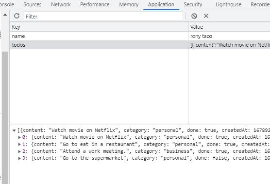

# Vue TO-DO List App with LOCALSTORAGE :pencil2:

How to build a To-Do List App in Vue 3 & Vite JS with LocalStorage.

## TOOLS :hammer:

* Vue 3
* Vite
* Local Storage

## Screenshot

### Desktop :computer:

### Mobile :iphone:

### LocalStorage :file_folder:

# Vue 3 + Vite 

This template should help get you started developing with Vue 3 in Vite. The template uses Vue 3 `<script setup>` SFCs, check out the [script setup docs](https://v3.vuejs.org/api/sfc-script-setup.html#sfc-script-setup) to learn more.

## Recommended IDE Setup 

- [VS Code](https://code.visualstudio.com/) + [Volar](https://marketplace.visualstudio.com/items?itemName=Vue.volar) (and disable Vetur) + [TypeScript Vue Plugin (Volar)](https://marketplace.visualstudio.com/items?itemName=Vue.vscode-typescript-vue-plugin).

